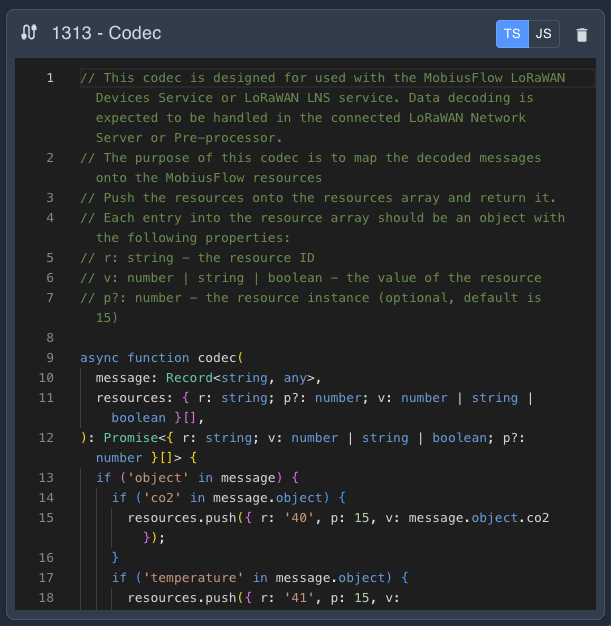

# What's New?

MobiusFlow V3 has been built from the ground up. We have listened to your feedback and added a host of new features to make MobiusFlow even more powerful and easier to use.

Tagging, we added it, custom object profiles, there too, and to make you even more productive we have added the ability for you to write your own data pre-processors and codecs. We are excite about these new features and are sure you will be too!

## Engine and Toolbox

Both the MobiusFlow Engine (the heart of MobiusFlow) and MobiusFlow Toolbox have been completely rewritten to be more efficient and easier to use.&#x20;

<figure><figcaption></figcaption></figure>

## Custom Object Profiles

Object profiles define the shape and properties of MobiusFlow objects. Before version 3 object profiles were built into each release and could not be easily created or modified by users.

Version 3 has redefined how object profiles work. Object profiles can now be freely created by users in a simple editor. In fact each new instance of MobiusFlow has no object profiles defined. Instead we have taken all of the object profiles from version 2 (and a bunch of new ones) and created object profile templates.

Object profiles can be created from scratch, from templates, or from any profile that you have already created and then customised to your application. This gives users full flexibility without adding complexity as new objects can also be added directly from templates and MobiusFlow will automatically create the profile for you.

<figure><figcaption></figcaption></figure>

### Exporting and Importing Profiles

Object profiles (along with their preprocessors, codecs and UI layouts) can be exported and imported allowing you to create your own library of profiles to be used on other projects.

## Preprocessors, Codecs and UI Layouts

<figure><figcaption></figcaption></figure>

### Preprocessors

Have you ever needed to modify data before it is written to a resource? Have you wanted to change from °C to °F on the fly as new data arrives? Was totalising energy readings from meters difficult?

Not any more as preprocessor functions will do that for you!

Each object profile can have a preprocessor function written in Typescript or Javascript which allow you to do just that, you can even write it directly in a built in IDE in MobiusFlow Toolbox.

### Codecs

Codecs make adding new decoders for raw sensor data a breeze. Instead of waiting for us to add new decoders for sensors like EnOcean, LoRaWAN, or Ingy, you can create an object profile and define the codec to decode the raw sensor telegram. As with preprocessors, these codecs can be written in Typescript or Javascript using the built in IDE.

### UI Layouts

Capturing default values such as sensor IDs when configuring objects is simplified by adding your own configuration UI in a simple JSON format.

## Value Persistence

The data stored in MobiusFlow objects can now be persisted between restarts of a service. No longer will temperate values drop to zero, people counts be lost, and energy readings disappear when services are restarted! Persistence can be configured on a service by service basis and values are included in backups

## [Tags](mobiusflow-toolbox-v3/tags.md)

Powerful tagging features have been added to both objects and resources. Tags can be defined on object profiles so that they are automatically added to each instance of an object, and added to individual object instances.&#x20;

You can use simple tags or add values to tags. Tags are included as metadata when reading values or receiving change-of-value events via the new API.

<figure><figcaption></figcaption></figure>


For version 3 we have chosen to use epoch versioning so don't be surprised that our new software versions start from 3000

