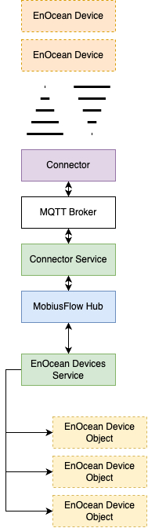

# EnOcean Devices

## Overview & Purpose

The _EnOcean Devices_ service handles the decoding of incoming data from EnOcean devices. All _EnOcean Devices_ services listen for EnOcean message broadcasts from the MobiusFlow hub. If any incoming EnOcean messages correspond to any EnOcean device object on a given _EnOcean Devices_ service, the service will decode the data and populate that object.

## EnOcean Objects

Each real-world EnOcean device must be represented in MobiusFlow by a corresponding EnOcean device object. To work correctly, these objects must exists within an _EnOcean Devices_ service.

To add new EnOcean device objects, navigate to the object configuration page of the EnOcean Devices service.

<figure><figcaption></figcaption></figure>

EnOcean device objects can added via the _Object Library_:

<figure><figcaption></figcaption></figure>

All EnOcean device objects require the EnOcean UID of the corresponding real-world EnOcean device to entered:

<figure><figcaption></figcaption></figure>

To realise any changes, the object settings must be saved and the service started / restarted:

<figure><figcaption></figcaption></figure>

Once the object is live, any decoded data from the corresponding EnOcean device can viewed by navigating to that objects resources:

<figure><figcaption></figcaption></figure>

## Dataflow & Connectors

In most cases data is brought in through MobiusFlow connectors. A full guide on setting up MobiusFlow connectors can be found [here](../../user-guides/mobiusflow-connectors/).&#x20;

The following diagram shows the full data flow between the EnOcean devices and their corresponding MobiusFlow objects. This is explained in full in the [MobiusFlow Connectors services article](mobiusflow-connectors.md).

<figure><figcaption>
MobiusFlow EnOcean dataflow
</figcaption></figure>

## Sending Data to EnOcean Devices

It is possible to send data from MobiusFlow to EnOcean devices via the flows using the MobiusFlow connectors service. The full article covering Receiving and Sending Raw EnOcean Telegrams in the Flows can be found [here](../flows/receiving-and-sending-raw-enocean-telegrams.md).
