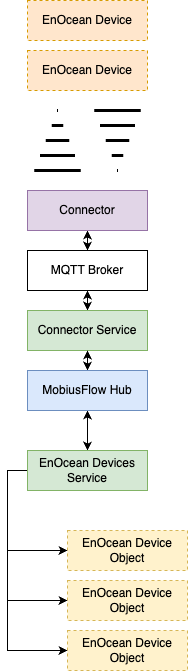

# EnOcean Devices

## Overview & Purpose

The _EnOcean Devices_ service handles the decoding of incoming data from EnOcean devices. All _EnOcean Devices_ services listen for EnOcean message broadcasts from the MobiusFlow hub. If any incoming EnOcean messages correspond to any EnOcean device object on a given _EnOcean Devices_ service, the service will decode the data and populate that object.

## EnOcean Objects

Each real-world EnOcean device must be represented in MobiusFlow by a corresponding EnOcean device object. To work correctly, these objects must exists within an _EnOcean Devices_ service.

To add new EnOcean device objects, navigate to the object configuration page of the EnOcean Devices service.

<figure><figcaption></figcaption></figure>

EnOcean device objects can added via the _Object Library_:

<figure><figcaption></figcaption></figure>

All EnOcean device objects require the EnOcean UID of the corresponding real-world EnOcean device to entered:

<figure><figcaption></figcaption></figure>

To realise any changes, the object settings must be saved and the service started / restarted:

<figure><figcaption></figcaption></figure>

Once the object is live, any decoded data from the corresponding EnOcean device can viewed by navigating to that objects resources:

<figure><figcaption></figcaption></figure>

## Dataflow & Connectors

In most cases data is brought in through MobiusFlow connectors. A full guide on setting up MobiusFlow connectors can be found [here](../../../user-guides/mobiusflow-connectors/).&#x20;

The following diagram shows the full data flow between the EnOcean devices and their corresponding MobiusFlow objects. This is explained in full in the [MobiusFlow Connectors services article](../mobiusflow-connectors.md).

<figure><figcaption>
MobiusFlow EnOcean dataflow
</figcaption></figure>

## Sending Data to EnOcean Devices

It is possible to send data from MobiusFlow to EnOcean devices via the flows using the MobiusFlow connectors service. The full article covering Receiving and Sending Raw EnOcean Telegrams in the Flows can be found [here](../../flows/receiving-and-sending-raw-enocean-telegrams.md).

#### Supported EnOcean Equipment Profiles (EEPs)&#x20;

#### Alongside many other protocols, MobiusFlow brings together a broad spectrum of EnOcean Equipment Profiles (EEPs) for smooth communication and automation between EnOcean and other monitoring, sensing and control devices via the MobiusFlow middleware solution.&#x20;

These EEPs detail communication protocols for energy-harvesting wireless devices, enhancing MobiusFlow's offerings in smart buildings, industrial automation, and beyond.&#x20;

**Switches and Rocker Profiles (F6-XX-XX)**

* F6-02-XX: Standardized rocker switch functionality, perfect for wireless and battery-free light switches.
* F6-01-01: Classic single rocker switch for versatile applications.
* F6-05-01 & F6-05-02: Advanced switches supporting multi-rocker configurations.
* F6-04-01: Specialised profile for unique switch requirements.

**Temperature and Humidity Sensors (A5-XX-XX)**

* A5-02-01 to A5-02-20: Comprehensive profiles for temperature and humidity sensing across varied ranges and resolutions.
* A5-04-01 to A5-04-03: Focused on precise temperature monitoring for HVAC and building automation.
* A5-06-02: Compact profile for humidity measurement.
* A5-07-01 to A5-07-03: Temperature and humidity combined for indoor climate monitoring.
* A5-08-01 & A5-08-08: Advanced temperature sensors for outdoor and industrial use.

**Light and Occupancy Sensors**

* A5-09-04 & A5-09-02: Profiles for daylight harvesting and light level monitoring.
* A5-10-03, A5-10-06, A5-10-12, A5-10-19: Advanced occupancy and motion detection sensors.
* A5-11-01 & A5-11-02: Multi-functional sensors for light, motion, and temperature.

**Energy and Utility Monitoring**

* A5-12-01 to A5-12-03: Profiles tailored for energy consumption and utility monitoring.
* A5-14-58 & A5-14-05: Energy efficiency sensors for load and power monitoring.
* A5-20-01: Compact profile for energy harvesting applications.

**People Counting and Building Analytics**

* IMBUILDINGS PEOPLE COUNTER: A specialised profile for tracking occupancy and people flow in smart buildings.
* D1-03-C1, D1-03-C2, D1-03-C0: Advanced profiles for presence detection and people counting.

**Advanced Actuator and HVAC Controls**

* D2-32-00 to D2-32-02: Actuator profiles for heating, ventilation, and air conditioning systems.
* D2-14-5C, D2-14-40 to D2-14-53: Comprehensive profiles for valve and motorised actuator control.
* D2-03-OA: Specialised actuator profile for unique applications.

**Miscellaneous Profiles**

* D2-05-00: General-purpose profile for binary data transmission.
* D2-01-0A to D2-01-12: Profiles for advanced control systems.
* D2-15-00: Versatile profile for industrial applications.

**Specialised Devices**

* ECHOFLEX MOS MT: Tailored profile for motion sensing in smart building environments.
