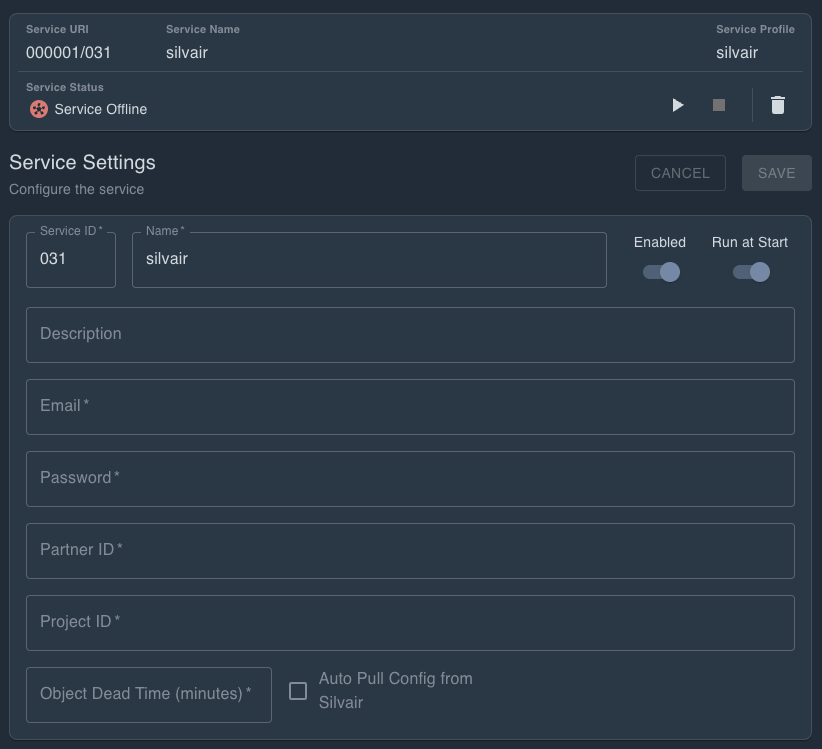

# MobiusFlow Connectors

## Purpose of Connector Service

MobiusFlow connectors are transceiver hardware that connect to the following technologies:

* [WorkPlace Occupancy](https://workplaceoccupancy.com/)
* [EnOcean](https://www.enocean.com/)

Connectors are designed to bridge the gap between these technologies and MobiusFlow via the _MobiusFlow Connectors_ service.

## Service Configuration & MQTT

The Connectors service uses MQTT to communicate with the Connectors. As such, the service must be pointed to and authenticated with an MQTT broker.

<figure><figcaption>
Connectors service configuration pane
</figcaption></figure>

The service configuration pane requires entry of the following:

<table><thead><tr><th width="223">Config Setting</th><th>Notes</th></tr></thead><tbody><tr><td>MQTT Broker</td><td>IP address / DNS name of where the broker is running. The service will assume MQTT (no TLS) however MQTTS (TLS) can be used by adding the mqtts:// prefix. In the most cases, the service will be set up to connect to the local MQTT broker running within MobiusFlow. As such, in this situation, the address of the broker will be <em>localhost</em>.</td></tr><tr><td>MQTT Port</td><td>The MQTT broker port. This will have been setup within the MQTT broker. Likely 1883 if using MQTT or 8883 if using MQTTS</td></tr><tr><td>MQTT Username</td><td>The username of the MQTT user set up within the MQTT broker</td></tr><tr><td>MQTT Password</td><td>The password of the MQTT user set up within the MQTT broker</td></tr></tbody></table>

Once these fields have been populated, save and start the service:

<figure><figcaption></figcaption></figure>

The MQTT connection status can then be observed within the service status:

<figure><figcaption>
Running connected Connectors service
</figcaption></figure>

The above screenshot shows a running example of a Connectors service connected to a local MQTT broker.

## Connector Objects

Each real-world connector must be represented in MobiusFlow using a connector object. The object settings require connector details such Serial Number and Pre-Shared Key (PSK) to be specified. It also allows the viewing of live connector status.

To add a connector object to the Connectors service, first navigate the to the service's object configuration page.

<figure><figcaption></figcaption></figure>

Once navigated to service's object configuration page,  a _MobiusFlowConnector_ object for each real-world connector should be added.

<figure><figcaption>
An unconfigured Connector object within the Connectors service
</figcaption></figure>

Each connector object requires the following configuration settings to be specified:

<table><thead><tr><th width="197">Config setting</th><th>Notes</th></tr></thead><tbody><tr><td>Serial Number</td><td>The serial number of the connector. In the form of MF_XXXXX. Can be found within the connector's configuration.</td></tr><tr><td>Pre-Shared Key (Key)</td><td>The unique pre-shared key of the connector. This can be anything however the key must be set to match within both the Connector object and the real-world Connector.</td></tr></tbody></table>


Ensure the service is restarted or hot-reloaded to realise changes made to objects


## Connector Status

Once the connector object is live, the status of it can be checked by navigating to the resources of that object:

<figure><figcaption>
Live status information from a Connector shown within the Connector object's resources
</figcaption></figure>

The above screenshots shows the useful status information a connected connector makes available. Checking if the connector is connected is possible by observing the _objectLastUpdate_ resource.

## Sensor Data

Raw sensor data is not displayed anywhere within the Connector object. Instead, the service automatically relays incoming data from authorised connectors to the MobiusFlow hub, where it is then broadcast to all MobiusFlow services.

Some service types such as the EnOcean service, listen for and decode these messages into useable data. If the sensor data is valid, those service will then go on to populate corresponding device objects based.

The flowchart below shows how data flows from device level into the corresponding MobiusFlow objects via the Connectors and Connectors service:

<figure><figcaption>
Connector Dataflow
</figcaption></figure>

## Sending Data to Devices via Connectors

The EnOcean technology sometimes requires messages /commands to be sent the devices. This is possible is MobiusFlow using the Flows. A full article on receiving and sending EnOcean telegrams within the flows can be found [here](../flows/receiving-and-sending-raw-enocean-telegrams.md).
