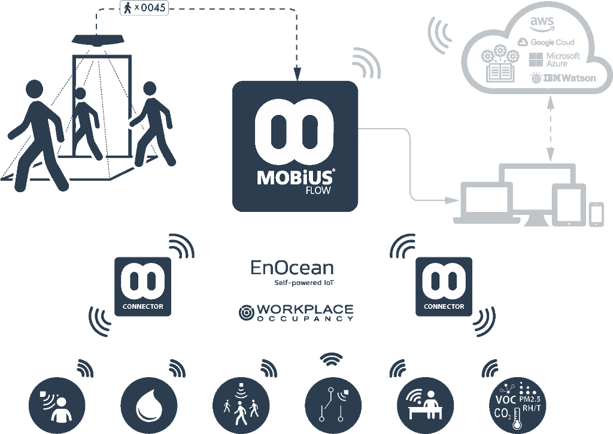

# MobiusFlow Connectors

<figure><figcaption>
MobiusFlow Connector
</figcaption></figure>

The Connector collects data from sensors and sends data to actuators via standard wireless sensor protocols such as EnOcean and Workplace Occupancy, and sends this data securely to a MobiusFlow using an MQTT based Protocol.

Once the data has been received by a MobiusFlow instance, it is decoded and the associated MobiusFlow object is updated with the latest sensor readings which can then be processed by the gateway.

<figure><figcaption>
Architecture
</figcaption></figure>

A full guide on configuring MobiusFlow for use with Connectors can be found [here](configuring-mobiusflow-for-use-with-connectors.md).

## Connector Options

There are several hardware options for the MobiusFlow Connector software:

* [Official Connector](mobiusflow-official-connector/)
* [Raspberry Pi](mobiusflow-raspberry-pi-connector/)
