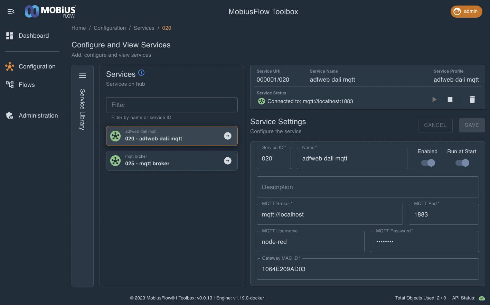

# Configuring Raspberry Pi Connector

## Accessing Configuration Page

### Via Balena Fleet

If the Connector is hosted via BalenaCloud and has an internet connection, the configuration can be accessed anywhere via the BalenaCloud Public Device URL.

#### MobiusFlow Hosted

If the connector is hosted by MobiusFlow, please contact support to receive the Public Device URL.

#### Self Hosted

The BalenaCloud Public Device URL can be found by Navigating to the connector device on the BalenaCloud fleet.

<figure><figcaption></figcaption></figure>

### Via Raspberry Pi Access Point

By default, the MobiusFlow connector will broadcast a WiFi access point, the name of which matches the connector's serial number (in the form of MF\_XXXXX). Connect to this access point on a computer or mobile device. Then the configuration window is accessible by browsing to 10.42.0.1.

### Via Local Network

If the connector is connected to a local network via Ethernet or WiFi (with a known IP address) and you're able to also connect to this network using a computer or mobile device, then simple browse to the local IP of the connector.&#x20;

## Login & Home

### Login

When browsed to the configuration window of the connector, a login screen is presented.

<figure><figcaption>
Connector configuration login Page
</figcaption></figure>

The default password of all new MobiusFlow connectors is:

**mobiusflow**

Note that, if the connector is not new, this login password may have been changed.

### Home Page

When on the the home page,  the current status of the connector is shown. This includes:

<table><thead><tr><th width="211">Property</th><th>Notes</th></tr></thead><tbody><tr><td>Serial Number</td><td>Required in the MobiusFlow connectors service. Note that this is copyable using the copy button displayed next to the number is itself</td></tr><tr><td>Ethernet Connection Status</td><td>The IP address will be displayed if connected</td></tr><tr><td>WiFI Connection Status</td><td>The IP address will be displayed if connected</td></tr><tr><td>On-Board WiFi Hotspot (Labelled WiFi AP)</td><td>Will show a green tick if the On-Board WiFi Access point is enabled</td></tr><tr><td>MQTT Connected</td><td>Will show a green tick to indicate the connector is has connected to MobiusFlow</td></tr><tr><td>Module 1 / Module 2</td><td>Will show which types of transceivers are physically connected to the Raspberry Pi</td></tr></tbody></table>

<figure><figcaption>
Connector configuration home page
</figcaption></figure>

The main menu also allows navigation to the connectors configuration pages. These includes those for Network Configuration, MQTT Configuration, Certification Configuration, and the Change Password page (allows the connector configuration password to be changed).

## Configure Network

It is critical that the MobiusFlow connector's network situation is such that it can access the target MobiusFlow instance over the network. This may be over the internet or simply over a local network.

In either situation, the connector must be connected to the network and the configure network page allows for this.

### Connection Type

The connection type allows choosing between a Wired or WiFi connection.&#x20;

If using a Wired connection, ensure the Raspberry Pi is plugged in via Ethernet.

<figure><figcaption>
Connector configuration networks page, in wired network mode
</figcaption></figure>

If using WiFi mode, the WiFi SSID and corresponding password must be populated.


Note that: In WiFi mode, the Wired network interface will remain enabled in the background. This acts as a secondary fall back interface, useful for accessing the connector the WiFi has failed to connect.


<figure><figcaption>
Connector configuration networks page, in WiFi network mode
</figcaption></figure>


Note that: If using in WiFi mode, using the Connector as WiFi access point is no longer possible. This is because the Raspberry Pi only contains a single WiFi adapter and therefore it can only be used to either connect to WiFi or as an access point.


### TCP/IP Settings

The TCP/IP settings allow switching between DHCP and Static IP allocation. Unless there are specific reasons to set the connector on a static IP address, using DHCP is recommended.

<figure><figcaption>
Connector configuration networks page, using DHCP
</figcaption></figure>

If using the connector in Static mode, the Subnet Mask, Default Gateway and DNS 1 can be set. If it is not clear what to use here, use the default settings as shown below.

Note that, the default gateway is not required however if the connector required access to the internet, the local IP address of the internet providing gateway (Network router / modem) must be populated here. This is often in the form XXX.XXX.XXX.1 or XXX.XXX.XXX.0 .

<figure><figcaption>
Connector configuration networks page, using static IP
</figcaption></figure>

### WiFi Access Point

Setting the connector up to be a WiFi access point is useful for two reasons.

Firstly, it allows you to connect to it, allowing for easy wireless access to its configuration page. Secondly, if this connector has internet access via ethernet, it can act as an internet enabled hotspot to connect WiFi device to, in-turn giving them internet access.


Note that: If using in WiFi mode, using the Connector as WiFi access point is no longer possible. This is because the Raspberry Pi only contains a single WiFi adapter and therefore it can only be used to either connect to WiFi or as an access point.


<figure><figcaption>
Connector configuration networks page, with AP Enabled
</figcaption></figure>

If the WiFi access point is enabled, a WiFi SSID and Password must be set. It is recommended the default SSID is used (This matches the the connectors Serial Number)

### Saving Changes

To save the changes click the save button. If there are an issues with the configuration, such as an invalid input in one of the fields, the form will show this and the changes will not be saved. If the settings were saved correctly, a pop up will show this after the save button has been clicked.


Note that, when changes are saved here, they're only being saved to the local changes within the browser window. To realise the changes in the connector, the Reconfigure and Reboot button must be clicked on the main menu


## Configure MQTT

### Overview

Connectors use MQTT to communicate with MobiusFlow. As such, the Configure MQTT page allows the connector to be pointed at a specific MQTT broker. In almost all cases, the broker will be running the MobiusFlow instance itself.

Before setting up the connector's MQTT configuration, ensure you first set up the MobiusFlow instance ready for this connection. A guide on how to do this can be found [here](../configuring-mobiusflow-for-use-with-connectors.md).

### Configuration Window

The configuration window shows the key 6 properties which must configured to allow an authorised connection to the MQTT broker.

<figure><figcaption>
Connector configuration MQTT page
</figcaption></figure>

### Explanation of Properties

<table><thead><tr><th width="159">Property</th><th>Explanation</th></tr></thead><tbody><tr><td>Address</td><td>The IP location of the MQTT broker. This may be a local IP address, an internet IP address or a DNS name. <strong>Do not include any protocol prefix</strong> (such as mqtt:// or https://)</td></tr><tr><td>Port</td><td>The port the MQTT broker is running on. If using the MQTT broker within MobiusFlow, this port number is set and shown within the service settings within the MQTT broker service within MobiusFlow. This is often 1883. Note that, if the MobiusFlow instance is hosted in the MobiusFlow cloud,  port 1883 is externally exposed on 8883 (i.e. use 8883 even if MobiusFlow shows 1883)</td></tr><tr><td>Username</td><td>The username of any MQTT user set up on the MQTT broker  (if using the broker within MobiusFlow, this can be set up within the MQTT broker service settings within MobiusFlow)</td></tr><tr><td>Password</td><td>The password of any MQTT user set up on the MQTT broker (if using the broker within MobiusFlow, this can be set up within the MQTT broker service settings within MobiusFlow)</td></tr><tr><td>PSK</td><td>The pre-shared key of the connector. This can be anything however it must match the pre-shared key set up within the target connector object within the connectors service within the MobiusFlow instance.</td></tr><tr><td>Use TLS</td><td>A true / false property determining if the connection will attempt to use MQTT of TLS. This depends on how MobiusFlow is hosted and where the connector is accessing it from. Most set ups which involving accessing MobiusFlow over the internet will use TLS. If using an instance of MobiusFlow hosted via the MobiusFlow cloud, always enable TLS.</td></tr></tbody></table>

### Saving Changes

To save the changes click the save button. If there are an issue with the configuration, such as an invalid input in one of the fields, the form will show this and the changes will not be saved. If the settings were saved correctly, a pop up will show this after the save button has been clicked.


Note that, when changes are saved here, they're only being saved to the local changes within the browser window. To realise the changes in the connector, the Reconfigure and Reboot button must be clicked on the main menu


## Realising Changes

Once the changes have been made locally, to implement the changes within the connector, click the Reconfigure and Reboot button.

<figure><figcaption>
Connector configuration Home page
</figcaption></figure>

This will cause the connector to reboot. As such, the configuration window's connection to the connector will be lost. This may automatically be restored once the connector reboots, but this may not be the case if the connector's configuration has changed such that it is no longer accessible over the network.
