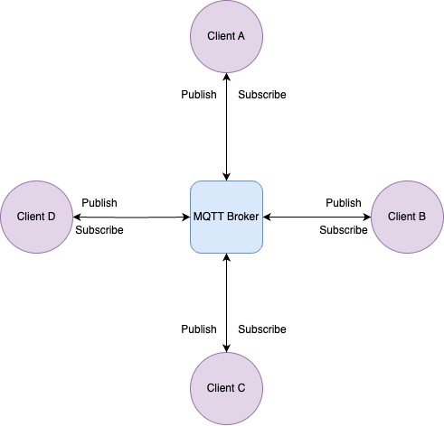
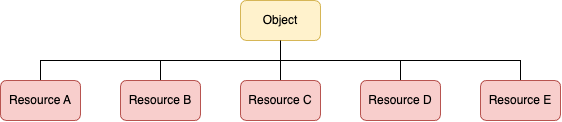
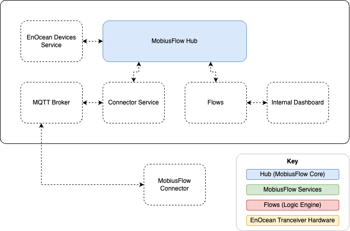
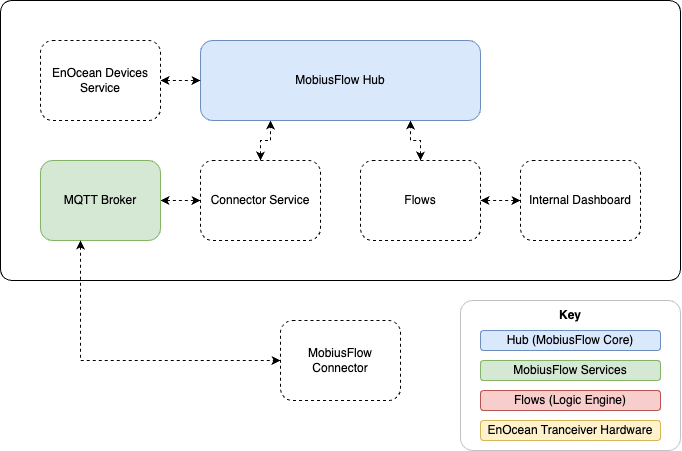
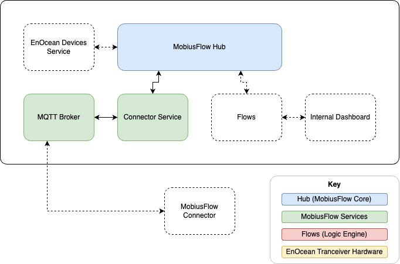
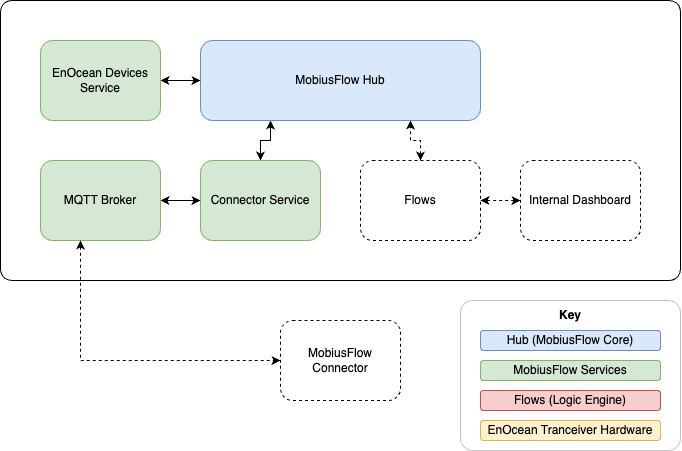
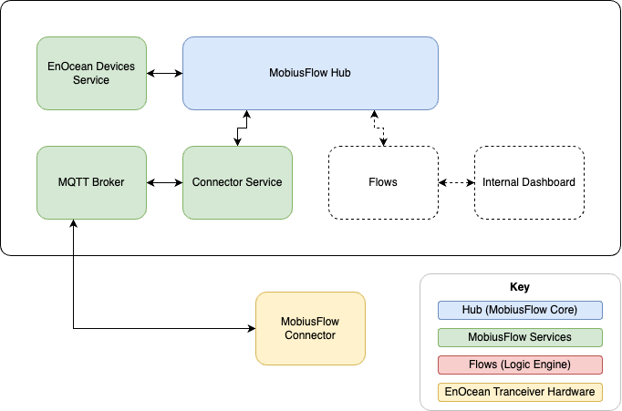
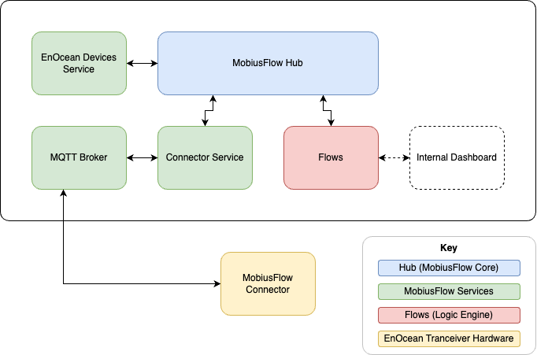

# Technical Training 1

## Technologies Referenced

This section outlines the major technologies reference in this training. Learning about this technologies is recommended.

### MQTT

MQTT (Message Queuing Telemetry Transport) is a lightweight and efficient publish-subscribe messaging protocol, commonly used in IoT (Internet of Things) applications.

<figure><figcaption>
MQTT Diagram
</figcaption></figure>

MQTT is widely used for data transport throughout the MobiusFlow software.

### JSON

JSON (JavaScript Object Notation) is a lightweight data interchange format that is easy for humans to read and write, and easy for machines to parse and generate.

Learn how JSON works [here](https://jsonpath.com/).

A basic knowledge of JSON is required when using the Flows (logic engine) within MobiusFlow.

### EnOcean

EnOcean is a short distance wireless communication protocol used widely within the IoT space. Each EnOcean device has a unique identifier (UID) which is used to identify the sender of all EnOcean wireless telegrams.

<figure><figcaption>
Diagram of EnOcean devices and a MobiusFlow connector (EnOcean Transceiver / MQTT Converter)
</figcaption></figure>

During this training, EnOcean will be used as an exemplar IoT technology to demonstrate MobiusFlow from the device level.

## MobiusFlow Overview

### Structure

A MobiusFlow instance runs a central MobiusFlow Hub. Services, each of which have a function within the overall solution, reside on the hub, and use it as a relay to communicate information.

<figure><figcaption>
MobiusFlow Hub / Service / Object hierarchy
</figcaption></figure>

A MobiusFlow object often represents a virtual equivalent of a real-world device, however can represent non-physical entities such as calculated data.

Some services can have MobiusFlow objects reside on them, often when the service needs to directly interact with those objects in some way. For example, objects representing EnOcean devices will always reside on an EnOcean devices service.

### Points / Resources

A MobiusFlow object contains many resources, each being its own individual data stream representing something about that object.

<figure><figcaption>
MobiusFlow Object / Resource hierarchy
</figcaption></figure>

Below shows a screenshot from the MobiusFlow software of the list of resources associated to an EnOcean Temperature / Humidity / C02 sensor.

<figure><figcaption></figcaption></figure>

**A point is a chargeable resource**. Notice in the above screenshot, the points column is only populated for Temperature, Humidity and CO2.

Also notice how the MobiusFlow software calculates your total point usage and displays this at the bottom right hand corner.

### URIs

All parts of the MobiusFlow hierarchy are assigned a unique URI with the following structure:

<mark style="color:blue;">**HID**</mark>/<mark style="color:green;">**SID**</mark>/<mark style="color:purple;">**PID**</mark>/<mark style="color:yellow;">**INS**</mark>/<mark style="color:red;">**RID**</mark>

<table><thead><tr><th width="82"></th><th width="437">Explanation</th><th>Format</th></tr></thead><tbody><tr><td><mark style="color:blue;"><strong>HID</strong></mark></td><td><strong>Hub ID</strong></td><td>6-Digit Hex</td></tr><tr><td><mark style="color:green;"><strong>SID</strong></mark></td><td><strong>Service ID</strong></td><td>3-Digit Hex</td></tr><tr><td><mark style="color:purple;"><strong>PID</strong></mark></td><td><strong>Profile ID</strong> (A MobiusFlow profile can be thought of as an object type)</td><td>4-Digit Hex</td></tr><tr><td><mark style="color:yellow;"><strong>INS</strong></mark></td><td><strong>Instance ID</strong> (The ID of that object instance)</td><td>4-Digit Hex</td></tr><tr><td><mark style="color:green;"><strong>RID</strong></mark></td><td><strong>Resource ID</strong></td><td>2-Digit Hex</td></tr></tbody></table>

#### Example URIs

**Service**

Full example URI of a service:

<mark style="color:blue;">**000001**</mark>/<mark style="color:green;">**020**</mark>

Representing <mark style="color:green;">service</mark> <mark style="color:green;"></mark><mark style="color:green;">**020**</mark> on <mark style="color:blue;">hub</mark> <mark style="color:blue;"></mark><mark style="color:blue;">**000001**</mark>.

**Object**

Full example URI of an object:

<mark style="color:blue;">**000001**</mark>/<mark style="color:green;">**020**</mark>/<mark style="color:purple;">**0028**</mark>/<mark style="color:yellow;">**0001**</mark>

Representing <mark style="color:yellow;">instance</mark> <mark style="color:yellow;">**0001**</mark> of object type (<mark style="color:purple;">profile</mark>) <mark style="color:purple;">**0028**</mark> on <mark style="color:green;">service</mark> <mark style="color:green;"></mark><mark style="color:green;">**020**</mark> on <mark style="color:blue;">hub</mark> <mark style="color:blue;"></mark><mark style="color:blue;">**000001**</mark>.

**Resource**

Full example URI of a resource:

<mark style="color:blue;">**000001**</mark>/<mark style="color:green;">**020**</mark>/<mark style="color:purple;">**0028**</mark>/<mark style="color:yellow;">**0001**</mark>/<mark style="color:red;">**40**</mark>

Representing <mark style="color:red;">resource</mark> <mark style="color:red;"></mark><mark style="color:red;">**40**</mark> on <mark style="color:yellow;">instance</mark> <mark style="color:yellow;">**0001**</mark> of object type (<mark style="color:purple;">profile</mark>) <mark style="color:purple;">**0028**</mark> on <mark style="color:green;">service</mark> <mark style="color:green;"></mark><mark style="color:green;">**020**</mark> on <mark style="color:blue;">hub</mark> <mark style="color:blue;"></mark><mark style="color:blue;">**000001**</mark>.

**Conclusion**

Using the URI system, it is therefore possible to reference any component of a given MobiusFlow configuration.

## Configuration Example

### Example Overview

This aims to show how data taken from EnOcean sensors at a hardware level, is brought into and through the MobiusFlow system, and then presented in the form of a dashboard.

#### Project Schematic

<figure><figcaption></figcaption></figure>

The following shows a colorless project schematic representing lack of implementation. As the project is implemented, this diagram will be colored in so progress can easily shown.

<figure><figcaption></figcaption></figure>


Note that the EnOcean devices have been dropped from the diagram for simplicity


#### Explanation of Services

<table><thead><tr><th width="197">Service</th><th>Explanation of requirement</th></tr></thead><tbody><tr><td>MQTT Broker</td><td>To allow MobiusFlow connectors to connect to and send data to</td></tr><tr><td>Connector Service</td><td>To collect incoming messages from MobiusFlow connectors and bring the data into the MobiusFlow Hub</td></tr><tr><td>EnOcean Devices Service</td><td>To decode raw EnOcean messages from the MobiusFlow hub and populate this service's child MobiusFlow objects with human-readable data.</td></tr></tbody></table>

### MobiusFlow Configuration

#### MQTT Broker

Add and start MQTT Broker service:



<figure><figcaption></figcaption></figure>


The MQTT Broker service has been added, configured and started.


#### Connector Service

Add connectors service, add a connector to the service, and finally start the service.

Add and start service:



Add a MobiusFlow connector object to the connectors service and configure:



<figure><figcaption></figcaption></figure>


The Connector service has been added, configured and started.


#### EnOcean Devices Service

Add EnOcean Devices service, add EnOcean device objects to the service, and finally start the service.



<figure><figcaption></figcaption></figure>


The EnOcean devices service has been added, configured and started.


### Connecting Hardware

For full information on how to configure a MobiusFlow connector see [here](../mobiusflow-connectors/mobiusflow-official-connector/configuring-a-connector/).



<figure><figcaption></figcaption></figure>


MobiusFlow connector is connected.


### Service Status and Data

The status of all service can viewed. This is a helpful insight into the current state of the solution as well as aiding with diagnostics.



The data of any live object can viewed by navigating to that object and then clicking on resources.



### Flows

Connecting the flows to the MobiusFlow engine, as well as the baseline principles of pulling into the flows is covered [here](../../technical-docs/flows/).

<figure><figcaption></figcaption></figure>

### Dashboard

In this example, the live state of the buttons on a 4-Rocker EnOcean switch is shown on a basic dashboard.



<figure><figcaption>
Completed project schematic
</figcaption></figure>

Using dashboard in the way illustrated can be as simple or as complex as required. Display widgets include graphs, charts and tables, as well input widgets such as switches, buttons, drop-downs and text inputs. Full documentation of the Flows dashboard can be found [here](https://dashboard.flowfuse.com/getting-started.html).
